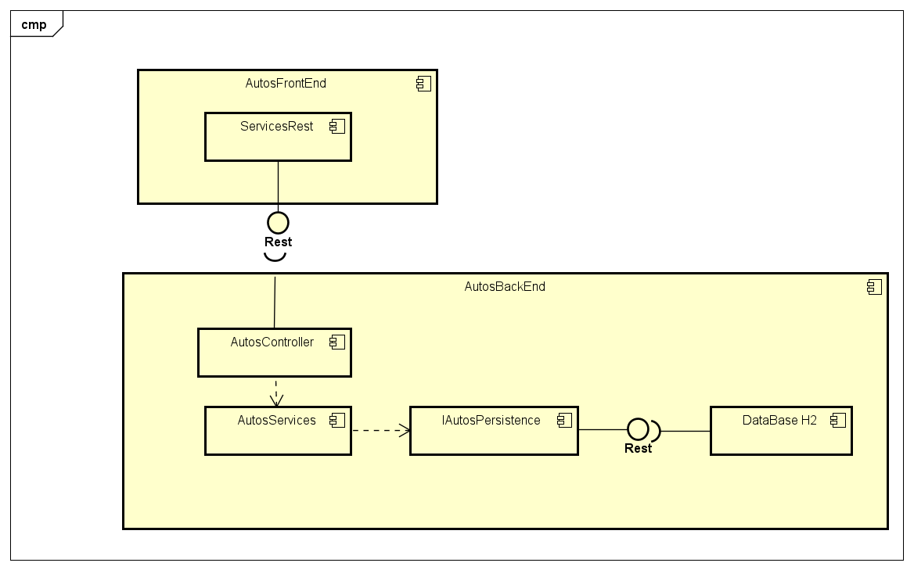

# Prueba técnica
## Johann Steven Bogotá Vélez
### Descripción de la arquitectura
Link FrontEnd : [Part Front](https://github.com/johann9911/pruebaTecnica_FrontEnd)
Para la parte de BackEnd se utilizo el framework SpringBoot para construir el servidor REST con tres servicios, acompañado de una base de datos en memoria llamada H2, lo que permite que en un mismo puerto se ejecute este servicio.
Por el lado del FrontEnd se utlizo el framework de JavaScript ReactJs, dentro se tiene un archivo js que realiza peticiones al API para realizar ciertos comportamientos.
Se utlizo el patron MVC (Modelo, vista, controlador) y inyección de dependencias que se utliza con las etiquetas de Spring Boot.

